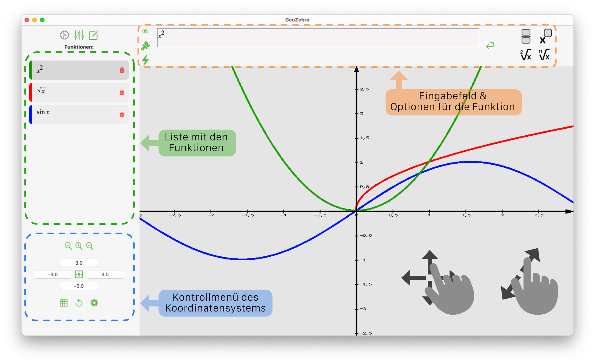
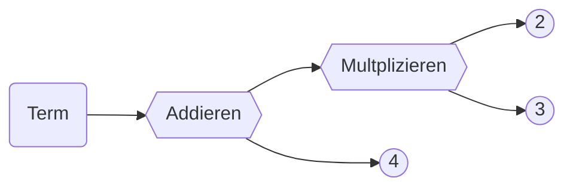
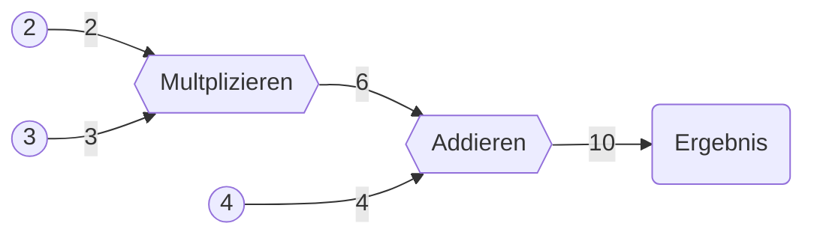
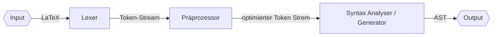
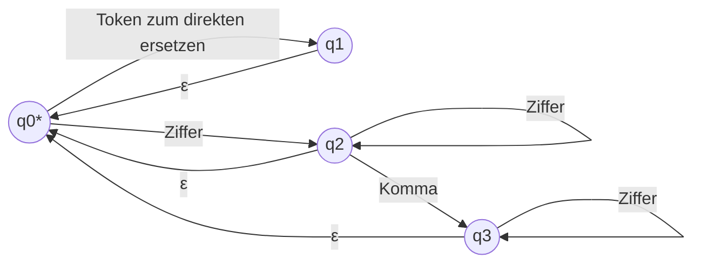
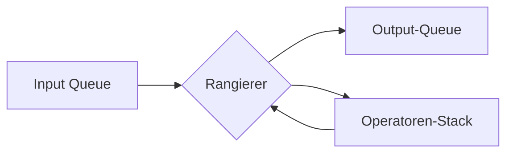
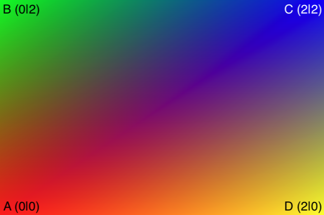
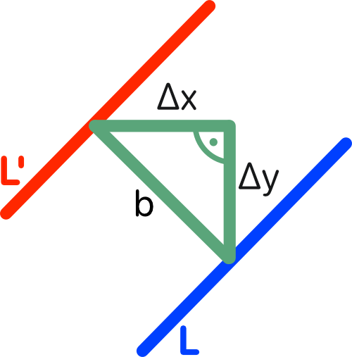
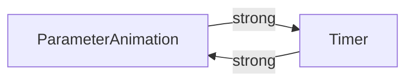

<!--© Benedict St.-->
# Inhalt:

- [Was ist GeoZebra?](#was-ist-geozebra)  
  - [Funktionsübersicht](#funktionsübersicht)
  - [Allgemeine Infos zur App und grundlegender Aufbau der Implementation](#allgemeine-infos-zur-app-und-grundlegender-aufbau-der-implementation)
- [Was ist ein Computer Algebra System?](#was-ist-ein-computer-algebra-system-cas)
  - [Was soll GeoZebras CAS können?](#was-soll-geozebras-cas-können)
- [AST und Darstellungen von mathematischen Ausdrücken](#ast-und-darstellungen-von-mathematischen-ausdrücken)
    - [Wie der AST implementiert ist](#wie-der-ast-implementiert-ist)
- [Parser](#parser)
  - [Was GeoZebras Parser können soll](#was-geozebras-parser-können-soll)
  - [Stufen des Parsers](#stufen-des-parsers)
  - [Lexer](#lexer)
    - [Wie der Lexer funktioniert](#wie-der-lexer-funktioniert)
  - [Präprozessor](#präprozessor)
  - [Postfix Notation](#postfix-notation)
  - [Shunting Yard Algorithmus](#shunting-yard-algorithmus)
  - [RPN zu AST](#rpn-zu-ast)
- [Implementationsdetails](#implementationsdetails)
  - [Wie das Rendering funktioniert](#wie-das-rendering-funktioniert)
  - [Zeichnen von Funktionen](#zeichnen-von-funktionen)
  - [Parameter Animationen und ARC](#parameter-animationen-und-arc)
- [Anhang](#anhang)
  - [Link zum Projekt](#link-zum-projekt)
  - [Anmerkungen und Kommentare](#anmerkungen-und-kommentare)
  - [Zitierte Quellen](#zitierte-quellen)
  - [Open Source Projekte](#open-source-projekte)
  - [Andere Ressourcen](#andere-ressourcen)


# Was ist GeoZebra?
  GeoZebra ist eine Mac-App, bei der der Nutzer eine mathematische Funktion (z.B. $y = x^2 -3$) eingeben kann und diese dann von einem eigenen Parser verarbeitet wird, um als Graph geplottet zu werden.

## Funktionsübersicht
  Das Hauptmenü ist in vier Sektionen unterteilt. Im Mittelpunkt steht dabei das Koordinatensystem, in welchem die Funktionen gezeichnet werden und der Nutzer via Multi Touch Gesten navigieren kann. Im unteren Drittel der linken Seitenleiste befindet sich ein weiteres Kontrollmenü für das Koordinatensystem, wo der Nutzer u.a. die Grenzen bestimmen kann. Ebenfalls in der Seitenleiste ist eine scrollbare Liste, in der alle Funktionen aufgelistet sind, wobei der Farbindikator links die gleiche Farbe wie die Funktion im Koordinatensystem hat, damit die Funktion leicht identifiziert werden kann. Wenn der Nutzer auf eine Funktion klickt, öffnet sich über dem Koordinatensystem ein Editor, wo der Nutzer die Funktion eingeben und modifizieren kann. Dort kann der Nutzer außerdem die Funktion aus- und einblenden, das Erscheinungsbild (Farbe, Strichdicke) modifizieren und ein Menü aufrufen, in welchem der Nutzer sich Funktionswerte, Werte der Ableitung, Integrale sowie Flächen der Funktion ausgeben lassen kann. 
<br>Des Weiteren sind die meisten der Kontrollelemente auch über Tastaturbefehle nutzbar.



## Allgemeine Infos zur App und grundlegender Aufbau der Implementation:
Die App ist in Swift (Version 5) geschrieben und mit macOS 11.0 aufwärts kompatibel. Außerdem ist der größte Teil der Benutzeroberfläche in *SwiftUI*, einem UI-Framework von Apple, geschrieben, wobei das Graphenfenster ein spezieller View ist, bei dem über die Metal Grafik-API die Funktionen mit Hilfe eigener Vektormodelle gezeichnet werden. Der WYSIWYG Matheeditor ist ein WebView in dem über Mathquill ein Inputfenster angezeigt wird. 


# Was ist ein Computer Algebra System (CAS)?
Ein "Computer Algebra System" ist ein Programm, das mathematische Ausdrücke symbolisch und nicht nur numerisch bearbeiten kann. Das bedeutet, dass ein CAS im Gegensatz zu einem einfachen Taschenrechner z.B. auch mit Variablen rechnen kann. 

> Ein Computer Algebra System biete dem Nutzer einen einfachen Zugang zum mathematischen Handwerk. Es sei eine Brücke zwischen dem großen mathematischen Wissen und dem Nutzer, der dieses Wissen anwenden wolle, um sein Problem zu lösen. Wenn man zum Beispiel das Integral einer Funktion wissen möchte, braucht man das Basiswissen von dem, was ein Integral ist, aber muss nicht unbedingt die Stammfunktion bilden können. Diese Aufgabe solle man einem Computer Algebra System überlassen, da es in den meisten Fällen besser darin sei. Es verfüge über mehr Algorithmen sowie Regeln und könne diese sehr schnell und fehlerfrei anwenden. 

So Gaston Gonnet 2005 im Interview für die *Society for Industrial and Applied Mathematics*, der das Computer Algebra System *Maple* mitentwickelt hat und in diesem Bereich geforscht hat. [vgl: [Q1](#zitierte-quellen), insb: S. 22-27] 


## Was soll GeoZebras CAS können?
- LaTeX zu einem abstrakten Syntaxbaum äquivalent umformen
- Werte einer Funktion berechnen
- Ableitungen berechnen
- Flächen und Integrale berechnen

**Operatoren:**
- Addieren, Subtrahieren, Multiplizieren, Dividieren
- Potenzen, Wurzeln
- trigonomische Funktionen (sin, cos, tan)
- Logarithmus-Funktionen

**Werte:**
- Zahlen (mit Komma und negativ)
- x-Wert
- Pi, eulersche Zahl
- Parameter (A-Z), um Funktionsscharen darstellen zu können

# AST und Darstellungen von mathematischen Ausdrücken
Eine wichtige Frage, die zu klären ist, ist die Weise, in der eine Funktion dargestellt werden soll.
Der Computer muss leicht in der Lage sein, die Funktion darzustellen und Werte auszurechnen, jedoch muss die Darstellung flexibel genug sein, um komplexe Funktionen darstellen zu können. Die Funktion als Text zu speichern eignet sich nicht, da Strings in keinerlei Hinsicht dafür gemacht sind, mathematische Operationen mit ihnen auzuführen und man jedes Mal, bevor man einen Wert ausrechnen möchte, die Funktion erneut aufwendig verarbeiten müsste (siehe [Parser](#stufen-des-parsers)). Die Darstellung als Baum hingegen eignet sich gut, da nicht weiter aufteilbare Grundrechenoperationen zu einer komplexen Funktion kombiniert werden können. Folgender Graph zeigt die Darstellung der Funktion "$2 \cdot 3 + 4$": 


Wenn das Programm jetzt den Wert des Terms berechnen möchte, betrachtet es die erste Node(*Addieren*) und versucht von dieser den Wert zu berechnen. Da diese aber in Abhängigkeit von zwei anderen Nodes ist, müssen diese zuerst berechnet werden. Die untere Node(*4*) kann ihren Wert direkt zurückgeben, da dieser feststeht und nicht abhängig von einer weiteren Node ist. Um die obere Node(*Multiplizieren*) ausrechnen zu können, müssen die child-Nodes berechnet werden. Die Nodes(*2*) und (*3*) können ihren Wert wieder direkt zurückgeben. Diese werden dann von der (*Multiplizieren*)-Node multipliziert und das Ergebnis an die (*Addieren*)-Node weitergegeben, die dann dieses Zwischenergebnis `6` mit (*4*) addiert und das Ergebnis dann an den ersten Knoten weitergibt.

Folgende Grafik zeigt, wie die Werte verarbeitet werden:



<div style="page-break-after: always;"></div>

### Wie der AST implementiert ist

Alle Kontenpunkte können als eigene Funktion mit einer unterschiedlichen Anzahl an Parametern definiert werden. Der Token der Zahl '5' hat keinen Input und kann seinen Wert direkt zurückgeben ($f:\varepsilon \mapsto 5)$. Während der Multiplizieren Knotenpunk zwei andere Knotenpunkte (a, b) als Input hat und dann das Produkt aus diesen zurückgibt ($f:(a,b) \mapsto a \cdot b$). 

Jeder Knotenpunkt muss das Protokoll `FunktionProt` implementieren, welches für den mathematischen Aspekt zwei Methoden vorgibt. Die Methode `func calculate(x: Float) -> Float` und `func derivative(x: Float) -> Float`. Beide liefern respektiv den Wert der Funktion oder den Wert der ersten Ableitung an der Stelle x.

Folgender Ausschnitt zeigt die Implementation des Multiplizieren-Knotenpunktes. Im Konstruktor der Klasse werden zwei Referenzen auf zwei andere Knotenpunkte übergeben, die gespeichert werden. Der y-Wert an der Stelle x des Knotenpunktes ist das Produkt aus den Werten von a und b (an der Stelle x) ($f(x)=a(x)\cdot b(x)$). Nach der Produktregel wird die Ableitung zurückgegeben ($f'(x)= a'(x) \cdot b(x) + a(x) \cdot b'(x)$). 

```swift
class Multiplizieren: FunktionProt{
	let a: FunktionProt
	let b: FunktionProt
	
	init(a: FunktionProt, b: FunktionProt){
		self.a = a
		self.b = b
	}
	
	func calculate(x: Float) -> Float {
		return a.calculate(x: x) * b.calculate(x: x)
	}
	
	func derivative(x: Float) -> Float {
		return (a.derivative(x: x) * b.calculate(x: x)) + (a.calculate(x: x) * b.derivative(x: x))
	}
}
```

# Parser

GeoZebras Parser generiert einen abstrakten Syntax Baum ([AST](#ast-und-darstellungen-von-mathematischen-ausdrücken)), der die Funktion darstellt, die der User eingegeben hat. Nachdem der Nutzer die Funktion in dem LaTeX-WYSIWYG Editor eingegeben hat, wird diese analysiert. Wichtig ist, dass die Bedeutung der Funktion nicht auf dem Weg von LaTeX zu AST verloren geht, also dass die beiden äquivalent sind.

### Was GeoZebras Parser können soll
- Vorrang der Operatoren / Klammern beachten
- Impliziete Operatoren erkennen: z.B. $2x$ -> $2 \cdot x$
- Konstanten erkennen: z.B. $\pi$ -> $3.14159...$
- Standardwerte erkennen: z.B. $\sqrt{x}$ -> $\sqrt[2]{x}$
- mit negativen Zahlen umgehen

## Stufen des Parsers
Der grundlegende Aufbau des Parsers sieht wie folgt aus:


Da der Prozess des Parsens von mathematischen Ausdrücken sehr komplex ist und viele Regeln zu beachten sind ist es wichtig ihn aufzuteilen. Man nähert sich seinem Ziel in Schritten an, die das Problem soweit vereinfachen, dass der nächste Schritt einfacher zu imuplementieren ist. Da jeder Schritt nur seine eigene Komplexität hat und die der anderen ignoriert wird, kann man die Komplexitäten "addieren" und hat eine Gesamtkomplexität von $O(n)$. Würde man alles in einem Schritt lösen wollen, würde sich die Komplexität mit jedem Schritt verdoppeln, wodurch man eine Gesamtkomplexität von $O(2^n)$ hätte. Es ist immer darauf zu achten, dass jede Umwandlung äquivalent ist, also den Sinn beibehält, und die neue Repräsentation das Problem vereinfacht.

## Lexer
Der Lexer wandelt den Input von einem String zu einem Token-Stream um. 
Ein Token ist ein *Atomic*, was bedeutet, dass man ihn nicht weiter teilen könnte (z.B. könnte man $1+23$ in die Token 1; +; 23 aufteilen, aber das $+$ kann man nicht weiter teilen, ebenso wie die $23$, da dies die Bedeutung ändern würde).
Jeder Operator / Zahl / Funktion wird zu einem Token umgewandelt. Die Reihenfolge bleibt bestehen.
<br>Beispiele für Token Typen:
sinus; x; Zahl(mit Wert); Plus; Geteilt; Wurzel; Potenz; etc.

Es ist sinnvoll Tokens zu verwenden, da jeder Token eine eigene Bedeutung hat, die ohne den Kontext der umstehenden zugehörigen Zeichen genau definiert ist.
<br>Beispiel: 
"s", "i", "n", "x"
<br>Wenn die weiteren Schritte mit einzelnen Zeichen weiter arbeiten würden, wäre das ein Problem. Das "i" alleine würde für eine Variable stehen. So könnte der Parser lesen: $s \cdot i \cdot n \cdot x$. Erst im Kontext der benachbarten Symbole ("s", "i", "n") hat die Kombination dieser eine andere Bedeutung und kann als $\sin(x)$ interpretiert werden. Damit diese Doppeldeutigkeit frühestmöglich aus dem Weg geschafft werden kann, wandelt der Lexer von Zeichen zu Tokens um. Jeder Token hat seine eigene Bedeutung, ist ein *Atomic* und behält diese Bedeutung unabhängig vom Kontext.
Erst der Parser erkennt die Bedeutung der einzelnen Tokens im Kontext der Nachbarn und fügt dieser entsprechend einen Token zur Output-Queue hinzu.
<div style="page-break-after: always;"></div> 

<br>Beispiele:

|Input|Token Strem|
|-|-|
|$123 \cdot x$		|\[Zahl(123)], \[Mal], \[x-Wert]							|
|$\cos(A)$			|\[cos], \[Klammer auf] \[Parameter("A")], \[Klammer zu]	|
|$-2-4$				|\[minus], \[Zahl(2)], \[minus], \[Zahl(2)]					|


Das Minus ist besonders schwierig, da es zwei Bedeutungen hat: einmal als Vorzeichen und einmal als Operator. Der Lexer kann dies nicht unterscheiden, da dies eine Syntax Frage ist und er den Kontext dafür nicht hat. Diese Aufgabe übernimmt daher der [Präprozessor](#präprozessor).

### Wie der Lexer funktioniert
Als erstes wird der Input mittels einfacher Ersetzungsregeln in ein einheitliches Format gebracht. 
Zum Beispiel gibt es für den Nutzer drei Wege um die Konstante π darzustellen ("\pi", "pi", "π").
Damit es im Verlauf einfacher wird, werden im Input String alle Varianten zu einer Variante vereinheitlicht.

Außerdem werden alle Zeichenkombinationen, die später zu einem einzelnen Token werden, auf ein Zeichen verkürzt. Dies vereinfacht den Automaten des Lexers enorm.
z.B. "\\left(" wird zu "(" oder "sin" wird zu "ð".

Folgende Abbildung beschreibt einen Teil des Automaten, der den Teil des tokenisens repräsentiert. q0 ist sowohl Start-, als auch Endzustand. Wenn ein ε gegangen wird, wird dem vorherigen Zustand entsprechend ein Token zur Output-Queue hinzugefügt. Des Weiteren ist der Automat verzeihend. Falls ein ungültiges Zeichen eingelesen wird, oder ein Komma, obwohl der aktuelle Zustand kein Komma akzeptiert, gibt er eine Warnung aus, jedoch kann das Lexen nicht Scheitern. Alle Fehler, die zum Scheitern des gesamten Pars-Prozesses führen können, treten später im Parser selbst auf, der Lexer warnt nur.


Wenn die langen Zeichenketten vorher nicht verkleinert worden wären, müsste der Automat deutlich mehr Zustände haben. Wenn der Automat ein "P" als aktuelle Eingabe hat, weiß er sofort, dass es sich um einen Parameter handeln muss, weil ein "Pi" vorher schon zu einem "π" umgewandelt worden ist, so kann er den Parameter sofort zum Output hinzufügen. Und dies ohne die Doppeldeutigkeit des "P" als Parameter oder Teil von Pi. Aufgrund dessen und dem Fakt, dass der Automat den aktuellen Zustand immer erst nach der nächsten Eingabe evaluiert, ist der Automat deterministisch und kann die "ε"s immer richtig gehen. 


<div style="page-break-after: always;"></div>

## Präprozessor:

Der Präprozessor optimiert den Token-Stream vom Lexer, sodass der Shunting Yard Algorithmus funktioniert. Er ergänzt, ersetzt und löscht in dem Input Stream, um einen äquivalenten Token-Stream zu erhalten, der den Sinn des ursprünglichen nicht verändert.

**Beispiele für Verallgemeinerungen:**


`[ln]` wird zu `[log]` `[zur_Basis]` `[euler]`

Hier wird der Token des natürlichen Logarithmus zu der Tokenfolge von "Logarithmus mit der Eulerzahl als Basis" umgeschrieben, damit im weiteren Verlauf der "ln-Token" nicht mehr beachtet werden muss und man beim implementieren des ASTs keine Ln-Funktion-Node implementieren muss, sondern einfach die normale Logarithmusfunktion dafür nutzen kann.

Außerdem fügt der Präprozessor implizite Werte hinzu.
Zum Beispiel, wenn für eine Wurzel der Wurzelexponent nicht explizit genannt wird, ist immer die Quadratwurzel gemeint. Somit gäbe es aber zwei Arten von Wurzeln: einmal die Wurzel mit dem impliziten Standardwert - 2 - und einmal die Wurzel zu einem beliebigen Wurzelexponenten. Um auch hier zu verallgemeinern, wird der implizite Wert hinzugefügt, wodurch es ein einheitliches Format für Wurzeln gibt. 


 Dasselbe gilt für implizite Klammern. Wenn z.B. der Exponent einer Potenz nur einen Token lang ist, sieht die LaTeX Syntax keine einschließenden Klammern vor:
 
 $x^2$ => `[x] [Potenz] [2]`

 $x^2+A$ => `[x] [Potenz] [2] [A]`
 
 $x^{2+A}$ => `[x] [Potenz] [{] [2] [plus] [A] [}]`

Der Token hinter dem Potenzzeichen ist der Exponent. Wenn der Exponent aus nur einem Token besteht, kann dieser direkt als zugehörig gesehen werden. Die Klammern sind wichtig, um zu kennzeichnen, welche Tokens noch zum Exponenten zählen und welche nicht mehr. Da es mit der impliziten Klammer jedoch wieder zwei Wege gäbe, um Potenzen auszudrücken, wird diese hinzugefügt, um weiter zu vereinheitlichen. 

Auch fügt der Präprozessor implizite Operatoren hinzu:
$2x$ => `[Zahl(2)] [xWert]`
Hier befindet sich zwischen der zwei und dem x ein implizites mal, welches ergänzt wird.
`[Zahl(2)] [x]` => `[Zahl(2)] [mal] [x-Wert]` 
 


## Postfix Notation
Die meiste Zeit schreiben wir mathematische Ausdrücke in der Infix-Notation, bei der die Operatoren zwischen den Operanden stehen. Die Postfix-Notation oder auch "<u>R</u>eversed <u>P</u>olish <u>N</u>otation (RPN)" eignet sich für Computer jedoch deutlich besser. Die Operatoren stehen dabei hinter den Operanden.

Ein Beispiel:
Infix: $2+3*4$

Postfix: $2 \ 3 \ 4*+$ //die 2,3,4 sind einzelne getrennte Zahlen ≠ 234

An diesem Beispiel lässt sich der große Vorteil der Postfix-Notation im Vergleich zur Infix-Notation feststellen. Wenn man das Ergebnis berechnen möchte, kann man bei der Infix-Notation nicht einfach von vorne nach hinten vorgehen und rechnen
"$2+3*4 \not=  5*4 = 20$", weil in diesem Beispiel die Rangfolge von Operatoren missachtet werden würde. 

Es gilt Punkt vor Strich und wenn man sequenziell vorgeht, staht der "plus"-Operator zu erst dar und daher würde erst plus gerechnet werden. Die würde das Ergebnis verfälschen.
Wenn man den Term richtig lösen wolle, müsste man ihn zuerst analysieren und die Reihenfolge der Operatoren bestimmen. Dies bedeutet, dass man nicht einfach nur rechnen kann, sondern jeden Operator im Kontext des gesamten Terms betrachten muss. Da dies schwierig ist, bietet sich die RPN an. Wenn man von hinten nach vorne vorgeht, kann man die Operatoren einfach sequenziell rechnen, ohne sich sorgen zu müssen, ob später noch ein Operator mit höherer Rangordnung käme. In der RPN benötigt man daher auch keine Klammern, da die Schreibweise von sich aus die Rangfolge regelt.

Wenn man das obige Beispiel der Postfix-Notation lösen möchte, geht man wie folgt vor:
Man liest die Operatoren rückwärts ein. Zeichen können einen festen Wert haben (z.B. Zahlen), oder in Abhängigkeit von weiteren Zeichen stehen (Operatoren).
Das Plus ist ein Operator, der zwei Parameter hat. Um an das Ergebnis von dem Plus zu kommen, braucht man also zwei andere Ergebnisse zuerst. Daher geht man im Term weiter. Das nächste Zeichen ist wieder ein Operator ("Mal") mit zwei Parametern. Also geht man weiter. Das nächste Zeichen ist eine Zahl. Die Zahl benötigt keine Parameter, weshalb sie ihr Ergebnis direkt zurückgeben kann, und man daher den ersten Parameter für das Mal hat. Für den zweiten Operator geht man weiter und findet die 3 als Zahl, und kann diese direkt nutzen. Jetzt, wo man alle Parameter für das Mal zusammen hat, kann man es ausrechnen $4 * 3 = 12$ und hat mit diesem Ergebnis den ersten Parameter für das Plus, geht also weiter und findet die 2 als Operanden und hat wieder beide Parameter für das Plus. Wenn man das Plus jetzt berechnet $12 + 2 = 14$ hat man mit dessen Ergebnis das Ergebnis des ganzen Terms.


Hier fällt eine große Ähnlichkeit zum [abstrakten Syntax Baum](#ast-und-darstellungen-von-mathematischen-ausdrücken) auf, wodurch es im Späteren sehr einfach wird, von der Postfix-Notation zu einem äquivalenten AST umzuwandeln. Für eine bessere Visualisierung hilft es sich die Grafik vom [AST](#ast-und-darstellungen-von-mathematischen-ausdrücken) anzugucken  


## Shunting Yard Algorithmus:
Mithilfe des Shunting Yard Algorithmus lässt sich der Token-Stream, der in der Infix-Notation ist, weil der Nutzer den Funktionsterm in Infix eingibt, in die Postfix-Notation umwandeln. 
Dieser Algorithmus wurde 1961 von Dr. E.W. Dijkstra [[Q2](#zitierte-quellen)] entwickelt und dessen Funktionsweise ist u.a. in einem Beitrag von Theodore Norvell [[Q3](#zitierte-quellen)] beschrieben.  


Der Shunting Yard Algorithmus verarbeitet die Input-Tokens seqentiell. Da der Kontext wichtig ist, in welchem die Tokens stehen, wird im Shunting Yard Algorithmus ein Stack benutzt, um diesen Kontext herzustellen.

Der grundlegende Aufbau besteht aus einer Input-Queue, einem Operatoren-Stack, einer Output-Queue, sowie einer Funktion, die die Tokens aus dem Input-Stream verarbeitet.

Folgendes Diagramm zeigt, wie die Tokens zwischen dem Input-Stream, dem Output-Stream und dem Operatoren-Stack, der als Zwischenspeicher fungiert, verlaufen. Der Shunting Yard Algorithmus gibt die Regeln vor, nach denen die Tokens verschoben werden. Er funktioniert wie ein Rangierer am Bahnhof, der die Weichen stellt, und gibt daher dem Algorithmus seinen Namen "Shunting Yard Algorithmus" (de: "Rangierbahnhof")- Algorithmus.


<div style="page-break-after: always;"></div>

Alle Tokens werden der Reihe nach eingelesen. Wenn der Token eine Zahl oder ein Parameter ist, dann kann dieser direkt zur Output-Queue hinzugefügt werden. Falls er eine öffnende Klammer ist, kann diese auf den Operatoren-Stack gelegt werden.
Wenn der eingelesene Token ein Operator ist, dann wird vom Operatoren-Stack der oberste Token zur Output-Queue hinzugefügt, solange wie ein Operator, der keine öffnende Klammer ist, oben auf dem Operatoren-Stack liegt und dieser eine höhere Rangfolge als der eingelesene Token hat, bzw. eine gleiche, wenn der eingelesene Token links assoziativ ist. Danach wird der eingelesene Token auf den Operatoren-Stack gelegt.
Wenn eine schließende Klammer eingelesen wird, dann wird vom Operatoren-Stack solange der oberste Token zum Output hinzugefügt, wie dieser keine öffnende Klammer ist. Falls keine öffnende Klammer gefunden wird, wird versucht, eine Klammer zu schließen, die vorher nicht geöffnet wurde, wodurch ein Syntax-Fehler vorliegt. Wenn eine öffnende Klammer gefunden wird, wird diese nur vom Operatoren-Stack entfernt, aber nicht zur Output-Queue hinzugefügt, da die Postfix Notation keine Klammern benötigt, um die Rangfolge von Operatoren an zu geben. 
Nachdem alle Input-Tokens eingelesen wurden, werden nun die verbleibenden Tokens vom Operatoren-Stack entfernt. Dafür wird immer der oberste Token vom Stack entfernt und zur Queue hinzugefügt. Falls noch eine öffnende Klammer auf dem Stack ist, scheitert das Parsen, da dies bedeuten würde, dass es eine öffnende Klammer gab, die nicht geschlossen wurde, wodurch ein Fehler vorliegt. 

Da es für das Parsen von mathematischen Ausdrücken erforderlich ist, einen Überblick über z.B. öffnende / schließende Klammern zu haben, eignet sich eine reguläre Grammatik nicht, um zu überprüfen, ob ein Eingabewort den Regeln der mathematischen Notation folgt. Hierfür ist auf der Chomsky-Hierarchie eine Typ-2-Grammatik erforderlich, wodurch der Shunting Yard Algorithmus durch einen Kellerautomaten beschrieben werden kann. 

Somit übernimmt der Shunting Yard Algorithmus den schwersten Teil der Syntax Analyse.


## RPN zu AST
Der finale Schritt des Parsens besteht darin, den Tokenstream in RPN-Form in einen abstrakten Syntax Baum umzuwandeln, mit dem der Render Teil sehr einfach Funktionswerte berechnen kann. Wie beim Kapitel der [Postfix-Notation](#rpn-zu-ast) schon beschrieben, ist die Rangfolge, in der die Tokens verarbeitet werden müssen, klar definiert. Nun kann man von hinten anfangen und rekursiv die Child-Knotenpunkte von Knotenpunkten suchen. 

```swift
func getAST() -> Node {
	guard let token = tokenStream.popLast() else{
		fatalError("kein Operand gefunden!")
	}
	if(token.hasParameters){
		return Node(token: token, parameter1: getAST(), parameter2: getAST())
	}else{
		return Node(token: token)
	}
}
```

Von dem Tokenstack wird der oberste Token gelesen und dann entfernt. Falls der Token nicht in Abhängigkeit von anderen steht, kann direkt eine Node in Abhängigkeit vom Tokentyp erstellt und zurückgegeben werden. Falls der Token jedoch ein Operator ist, müssen die Operanden gesucht werden. Dafür kann die Funktion sich dann selber rekursiv aufrufen und nach den gleichen Regeln eine Node erstellen, die eine Endnode sein kann oder auch in Abhängigkeit von anderen Nodes stehen kann. Da in der Postfix-Notation die Rangfolge strikt von hinten nach vorne geht, ist der Algorithmus, um von einer linearen Datenstruktur zu einem Baum zu kommen, sehr einfach. 


<br>

# Implementationsdetails

## Wie das Rendering funktioniert
Das Rendering funktioniert über die Metal Grafik Api. GeoZebra sendet Befehle an die Grafikkarte, welche diese dann ausführt und dann das Ergebnis zurückgibt, damit es in der App gezeigt werden kann. Diese Befehle werden in einem *Commandbuffer* zusammengefügt und in einem *Request* an die Grafikkarte gesendet. GeoZebra liefert der Grafikkarte einen Buffer mit Vektoren und einen Buffer, in dem die Indexe der Vektoren gespeichert sind, die miteinander verbunden werden sollen. Dazu wird ein *Render Pass* erstellt, in welchem diese Inputs enthalten sind und der dann zu einem Befehl wird. Der *Command Buffer* wird zur *Command Queue* hinzugefügt und dann von der Grafikkarte abgearbeitet. Diese liefert das Ergebnis dann zurück an die App, damit die ausgerechneten Pixel im Grafikfenster der App angezeigt werden können. 

Die Grafikkarte wandelt von einer Koordinatenebene zu einer Pixelebene um, welche auf dem Bildschirm zu sehen ist.
Die Vektordaten enthalten jeweils drei Parameter x, y, z und die Farbe, die der Punkt haben soll.
In den Indexdaten stehen die Indexe der Vektoren, die verbunden werden sollen. Es werden jeweils drei Vektoren miteinander verbunden (also ein Dreieck gezeichnet). [[vgl. Q4](#zitierte-quellen)]


Folgendes Beispiel zeigt, wie ein Quadrat zwischen den Punkten A,B,C,D gezeichnet wird. Das Array "vertices" gibt die Koordinaten und Farbe der Punkte an, während das Array "indices" angibt, welche der Punkte miteinander verbunden werden. Das Quadrat wird in einem linearen Farbverlauf eingefärbt. Der Punkt A hat die Farbe rot und der Punkt B die Farbe grün. Alle Pixel zwischen diesen Punkten nähern ihre Farbe an. Wenn man von Punkt A zu Punkt B geht, wandert der Farbton von Rot zu Grün. Und zu Punkt C ist es das Gleiche, wobei noch eine dritte Farbe Einfluss hat. 

SIMD ist ein Protokoll, wobei "SIMD" für "Single Instruction, Multiple Data" steht. Im Endeffekt stellt SIMD3<Float> ein Array mit drei Elementen vom Typ Float dar. Jedoch bietet das SIMD Protokoll den Vorteil, dass eine Operation mit mehreren Werten gleichzeitig ausgeführt werden kann, wodurch SIMDs sich sehr gut zur Darstellung von Vektoren eignen. Wenn man `SIMD2<Float>(1,2) + SIMD2<Float>(3,4)` rechnet, werden jeweils die x1 und x2 Werte addiert, wodurch die Operation folgendes Ergebnis liefert: `SIMD2<Float>(4,6)`. Wenn die Befehlssatzarchitektur über SIMD Hardware Befehle verfügt, kann die Benutzung von SIMD Anweisungen gegenüber von sequenziellen Rechnungen eine Performancesteigerung herbeiführen. 
[vgl. [Q5](#zitierte-quellen) & [Q6](#zitierte-quellen)]

```swift 
let vertices = [
	Vertex(position: SIMD3<Float>(0,0,0), color: SIMD4<Float>(1,0,0,1)), //A - rot
	Vertex(position: SIMD3<Float>(0,2,0), color: SIMD4<Float>(0,1,0,1)), //B - grün
	Vertex(position: SIMD3<Float>(2,2,0), color: SIMD4<Float>(0,0,1,1)), //C - blau
	Vertex(position: SIMD3<Float>(2,0,0), color: SIMD4<Float>(1,1,0,1)), //D - gelb
]
let indices = [
	0,1,2, //Dreieck ABC oben links
	0,2,3  //Dreieck ACD unten rechts
]
```


<a name="linktoimage"></a>



<div style="page-break-after: always;"></div>


## Zeichnen von Funktionen
GeoZebra rechnet für jede Funktion für 2000 x-Werte die Ordinate aus. Wenn man die Punkte "verbinden" würde, hätte man eine Linie, die den Funktionsgraphen repräsentiert, jedoch wäre diese nicht sichtbar, da sie unendlich dünn wäre. Daher muss man noch eine zweite Linie versetzt zeichnen, damit die beiden Linien zwischen sich eine sichtbare Fläche einschließen können. Eine wichtige Frage ist nun, wie die Linie versetzt sein muss. Man könnte einfach die Ordinate plus die gewünschte Breite rechnen, was für $y = c$ auch durchaus funktioniert, jedoch fällt auf, dass je steiler eine Funktion wird, desto schmaler wird sie. Weil für jeden x-Schritt den diese macht, macht sie mehr y-Schritte und da nur vertikal verschoben wird, reicht das Verschieben nicht aus. Wenn man die Gerade $x=2$ betrachtet, fällt auf, dass, wenn man bei jeder Ordinate plus eine Konstante rechnet, die beiden Linien aufeinanderlägen, wodurch sie keine Fläche einschließen würde, was bedeutete, dass kein Graph sichtbar wäre. Daher muss die Linie nicht um eine konstante vertikal verschoben werden, sondern jeder Punkt der Linie L' auf der x- und y-Achse, basierend auf der Steigung der Funktion an der Stelle von L. Folgende Formeln zeigen, wie basierend auf der Steigung berechnet wird, um wie viel die Punkte von L' jeweils verschoben werden müssen.

Sei $m$ die Steigung und $b$ die gewünschte Breite des Funktionsgraphen und $\Delta x$ bzw. $\Delta y$ die Werte um die Punkte von L' respektiv verschoben werden müssen, dann folgt:

<div >
<div style="float:left;">

$$m = \frac{\Delta y}{\Delta x} \Leftrightarrow \Delta y = m \cdot \Delta x$$

$$b = \sqrt{(\Delta x)^2+ (\Delta y)^2}\Leftrightarrow  b = \sqrt{(\Delta x)^2+ (m \cdot \Delta x)²}$$

$$\Rightarrow \Delta x = \frac{b}{\sqrt{m²+1}}$$

</div>
<div>

</div>
</div>


## Parameter Animationen und ARC

Die Parameter Animation erfolgt über ein System von Master und Slaves. Wenn ein Parameter hinzugefügt wird, wird ein Objekt vom Typ `ParameterMaster` erstellt und eine starke Referenz auf dieses Objekt in der Klasse Datenmodell gespeichert. Die Logik für den Wert des Parameters und dessen Animation wird von dem Master kontrolliert. Wenn der Nutzer eine Funktionsschar eingibt, wird ein Objekt vom Typ `ParameterSlave` erstellt, das als Node im AST fungiert. Dieses Objekt hält eine starke Referenz auf den `ParameterMaster` vom Parameter und liefert für den Parameterwert den Wert, der vom Master vorgegeben wird.


Der `ParameterMaster` hält eine starke Referenz auf ein dem Protokoll `ParameterAnimation` konformes Objekt. Dieses kann einen nicht animierten Wert haben, den der Nutzer z.B. über einen Slider reguliert, oder einen animierten Wert. Die Klasse `AnimationVerlauf` liefert einen animierten Wert. Dafür wird alle $T$ Sekunden (basierend auf den vom Nutzer eingestellten Animationsticks) eine Funktion aufgerufen, die den Wert basierend auf $\Delta t$ dem Animationsmuster entsprechend anpasst. Hierfür wird ein `Timer` benutzt. Jedoch ergibt sich ein Problem. Das Objekt `ParameterAnimation` hat eine starke Referenz auf den `Timer` und der `Timer` hat eine starke Referenz auf die `ParameterAnimation`.

Für die Arbeitsspeicherverwaltung benutzt Swift ein System namens *ARC* "Automatic Reference Counting". Um zu entscheiden, ob ein Objekt gelöscht und der Arbeitsspeicher wieder freigegeben werden kann, wird gezählt, wie viele Referenzen es auf dieses Objekt gibt. Wenn es keine Referenzen auf ein Objekt gibt, kann von nirgends auf dieses Objekt zugegriffen werden, wodurch es keine Verwendung mehr hat und gelöscht werden kann. Dies alles geschieht während des Komplierens, wodurch die Speicherverwaltung zur Laufzeit nur sehr wenige Ressourcen verbraucht.

Der `Timer` und die `ParameterAnimation` bilden einen sogenannten *Retain Cycles*, genauer *strong reference cycle*. Der Timer kann nicht gelöscht werden, weil die Parameteranimation auf ihn verweist und die Parameteranimation kann nicht gelöscht werden, weil der Timer auf ihn verweist.   


Wenn jetzt ein Objekt vom Typ `ParameterMaster` erzeugt und danach gelöscht wird, wird der Speicher für den `Timer` und die `ParameterAnimation` erst freigegeben, wenn die App geschlossen wird. Um dieses Problem zu lösen, bietet Swift neben dem Standard der starken ("strong") Referenz zwei weitere Typen von Referenzen: schwach ("weak") und herrsenlos ("unowned"). Diese erlauben es auf ein Objekt zu verweisen, ohne dessen Löschung zu verhindern.

Wenn eine Referenz als "weak" gekennzeichnet ist, zählt ARC diese nicht mit. Es kann also auf ein Objekt verwiesen werden ohne das garantiert ist, dass dieses Objekt nicht gelöscht wird. Daher hat eine mit `weak` gekennzeichnete Referenz immer einen optionalen Wert. Swift erlaubt es nicht, direkt auf Attribute oder Methoden von optionalen Objekten zuzugreifen, weshalb man entweder mit einem "!" kennzeichnen kann, dass Swift davon ausgehen kann, dass das Objekt noch existieren müsste, falls es jedoch nicht existieren würde, würde das Programm abstürzen. Daher sollte man das Ausrufezeichen nur mit Vorsicht benutzten und wenn garantiert ist, dass in dem verwendeten Kontext das Objekt noch existiert. Über eine `if`-Abfrage z.B. `if(object != nil)` oder alternative Schnellschreibweisen kann man prüfen, ob das Objekt noch existiert und dementsprechend fortfahren.

Eine weitere Möglichkeit, um *Retain Cycles* zu verhindern, ist es, eine Referenz als herrenlos zu kennzeichnen. Genauso wie bei einer schwachen Referenz, werden herrenlose Referenzen von ARC auch nicht mitgezählt. Jedoch sehen herrenlose Referenzen vor, dass das referierte Objekt gleichlang oder länger existiert als das Objekt, welches die Referenz besitzt. Daher würde ARC die Referenz nie auf `nil` setzen, falls das Objekt gelöscht werden würde, und die Referenz würde auf eine Adresse im Speicher zeigen, bei der nicht mehr das Objekt liegt, wodurch das Programm abstürzen würde. [vgl. [Q7](#zitierte-quellen)]

| Beziehung | Englisch | Beschreibung |
| - | - | - |
| stark | `strong` | hat und hält fest |
| schwach | `weak` | kann haben |
| herrenlos | `unowned` | muss haben aber hält nicht fest | 

**Beispiel:**

Eine Person kann einen Pass haben, aber ein Pass muss eine Person haben. Eine Person existiert länger oder genauso lang wie ihr Pass. Angenommen, es gäbe eine Liste mit allen Personen und eine mit allen Pässen in einem Land. Die Person würde mit einer schwachen Referenz auf den Pass referieren, der Pass mit einer besitzlosen Referenz auf die Person. Wenn ein Pass abläuft und daher aus der Liste der Pässe entfernt wird, dann würde ARC dieses Objekt löschen können, da es keine starke Referenz auf den Pass mehr gibt. Die Referenz von der Person auf den Pass wird dadurch auf `nil` gesetzt. Wenn eine Person aus einem Land auswandert, wird die Person aus der Liste der Einwohner entfernt und von ARC gelöscht. Da die Referenz von dem Pass auf die Person besitzlos ist, würde diese nicht auf `nil` gesetzt werden und die Referenz würde ins Unbekannte zeigen. Wenn jetzt über einen Pass versucht wird, auf die Informationen der Person zuzugreifen, würde das Programm abstürzen. Bei der besitzlosen Referenz wird davon ausgegangen, dass das referierte Objekt länger existiert als das mit der Referenz. Daher müsste, wenn eine Person auswandert, "manuell" der Pass aus der Liste der Pässe gelöscht werden.
Wenn man wollte, dass die Pässe weiterhin gespeichert werden sollen, müsste man die Referenz von dem Pass auf die Person als stark kennzeichnen (bzw. nicht schwach / besitzlos, weil stark der Standard ist). Damit würde das Objekt Person nicht gelöscht werden, wenn die Person aus der Liste der Einwohner entfernt wird, weil der Pass noch auf die Person verweist.


# Anhang


## Link zum Projekt
Der Sourcecode sowie die fertige App sind [hier](https://github.com/BenedictSt/GeoZebra) zu finden. (github.com/BenedictSt/GeoZebra)


## Anmerkungen und Kommentare:
- Auf dem [Beispielbild](#linktoimage) ist das Quadrat nicht quadratisch, da die y-Achse gestaucht ist, weil das Seitenverhältnis des Fensters nicht 1:1, sondern ca. 3:2 ist.

<!--- Quellen--->
## Zitierte Quellen:
- Q1 - Gonnet Interview: http://history.siam.org/pdfs2/Gonnet_final.pdf
- Q2 - S.Y.A Orginal: https://www.cs.utexas.edu/~EWD/MCReps/MR35.PDF
- Q3 - Funktionsweise S.Y.A.: https://www.engr.mun.ca/~theo/Misc/exp_parsing.htm
- Q4 - Swift Metal: https://developer.apple.com/documentation/metal/
- Q5 - Swift SIMD: https://developer.apple.com/documentation/swift/simd
- Q6 - ARM SIMD: https://developer.arm.com/documentation/102474/0100
- Q7 - Swift ARC: https://docs.swift.org/swift-book/LanguageGuide/AutomaticReferenceCounting.html

## Open Source Projekte:

Für den WYSIWYG-Mathe-Editor:
- [github.com/karan101292/MathquillBasedEditor](https://github.com/karan101292/MathquillBasedEditor) *MIT*
- [github.com/mathquill/mathquill](https://github.com/mathquill/mathquill) *Mozilla Public License V2.0*
- [github.com/jquery/jquery](https://github.com/jquery/jquery) *MIT*

## Andere Ressourcen:
- https://developer.apple.com/documentation/technologies
- https://developer.apple.com/documentation/metal/using_a_render_pipeline_to_render_primitives
- https://developer.apple.com/documentation/metal/setting_up_a_command_structure
- https://developer.apple.com/documentation/metal/render_passes
- https://developer.apple.com/metal/Metal-Shading-Language-Specification.pdf#//apple_ref/doc/uid/TP40014364
- https://developer.apple.com/design/human-interface-guidelines/macos/overview/themes/
- https://www.clientresourcesinc.com/2018/07/27/rendering-graphics-with-metalkit-swift-4-part-2/
- https://introcs.cs.princeton.edu/java/11precedence/
- https://www.tu-chemnitz.de/urz/archiv/kursunterlagen/C/kap2/vorrang.htm

Letzter Zugriff auf alle Quellen: 07.04.2022

