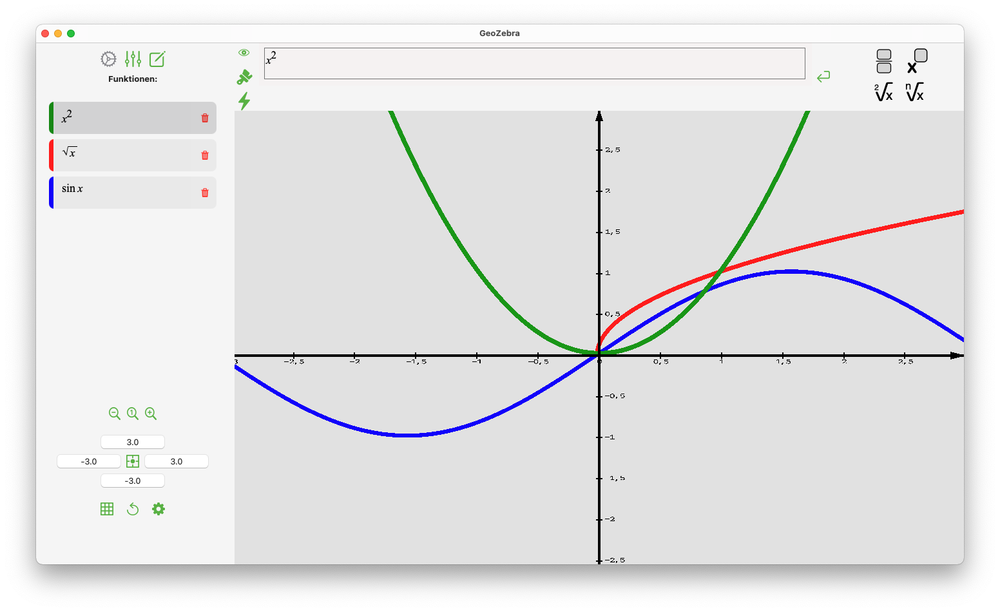

# GeoZebra

### Funktionsplotter mit eigenem Computer Algebra System.

## Funktionen:
- Plotten von Funktionen
- interaktives Graphenfenster
- Funktionseditor mit Vorschau
- Berechnen von Ableitung, Integral und Fläche
- Funktionsscharen mit Parametern
- Parameter animieren

## Installieren:
1. Zipdatei [hier](https://github.com/BenedictSt/GeoZebra/releases/download/v1.1/GeoZebra.zip) herunterladen
2. Zip mit einem Doppelklick öffnen
3. Mit einem Rechtsklick auf die App -> "öffnen"
	1. Schritt 3 ggf. wiederhohlen
4. ggf. in den Systemeinstellungen -> Sicherheit mit "dennoch öffnen" bestätigen
5. Mit "öffnen" bestätigen

## Systemvoraussetzungen: 
macOS 11.0 Big Sur oder neuer

## Credits:
- [github.com/karan101292/MathquillBasedEditor](https://github.com/karan101292/MathquillBasedEditor) *MIT*
- [github.com/mathquill/mathquill](https://github.com/mathquill/mathquill) *Mozilla Public License V2.0*
- [github.com/jquery/jquery](https://github.com/jquery/jquery) *MIT*

## Lizenz

Boost Software License 1.0 © [Benedict](https://github.com/benedictst)
